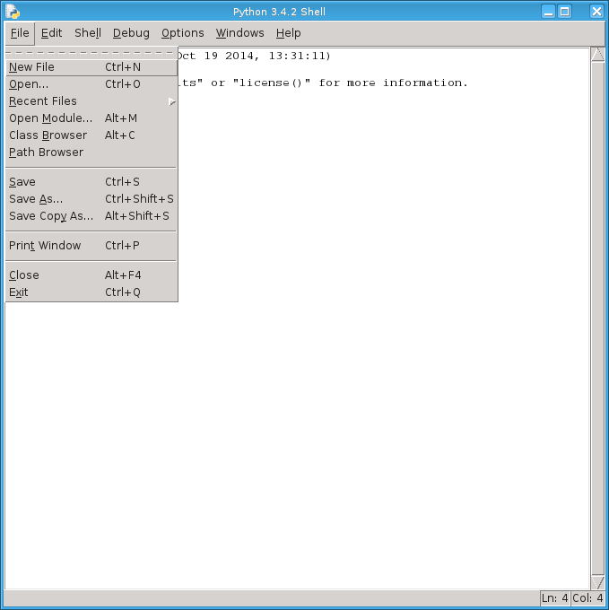
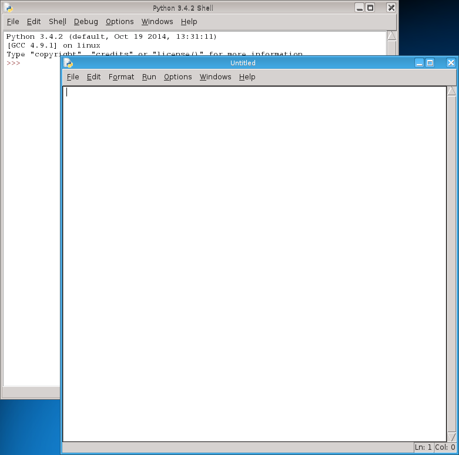
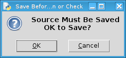
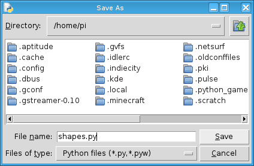
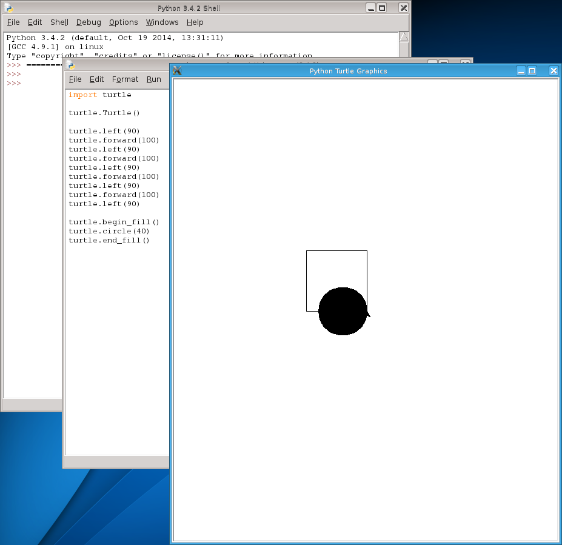

First program
=============

So far we have been using Python's interactive shell, built into the IDLE program, to experiment with Python in a way that is familiar to us - performing calculations, calling functions, giving values in memory a name.  We have started to veer out of this familiar territory by using other programs (known as modules), such as the turtle module, to extend what Python can do by itself.  Using the interactive shell allows us get to know the language, but it limits us effectively to one statement of code - a line that when you press return, will be run straight away and gives you back an answer (if there is one).

We will now learn how to use IDLE in order to write a full program, one that can be run on its own.  This means we can write the program once, and run it many times without the need to re-write the program each time.  We only need to change our program to modify its behaviour, or correct errors, not having to it from scratch each time.  It also means we can write longer more interesting programs!

Ed
--

To write a program, and modify it later, we use an *editor*.  Thankfully, IDLE not only has the interactive shell we have been using, but an editor built-in as well.

To start Python editor, first start IDLE itself (see chapter 0 for this if you have forgotten).  Then, using the mouse pointer, click on the ``File`` menu at the top of the shell window, and click again on the ``New File`` menu item, like so:

This will bring up a new window, the editor window.  The shortcut for this is to hold down the ``Ctrl`` key, towards the bottom left of your keyboard, and hit the ``N`` key (N for New).  This blank window is where we type in our new program:

.. tip:: The best arrangement is to have your interactive shell on the left and the editor window on the right.  You can do this on the Raspberry Pi by using the mouse, clicking on the interactive shell title bar using the left mouse button (keeping it pressed down) and try to pull the top of the interactive window past the left hand side of the screen - it should then snap into a shape that takes up the left 50% of your screen.  Do a similiar procedure with the editor window, but try to drag it past the right side of the screen.  You will then have the two windows you need to see, side by side.

The scene is set.

Our first program
-----------------

Our first complete program will be the same as the code we typed in the previous chapter.  Therefore, in this new editor window, type in the following::

    import turtle

    turtle.Turtle()

    turtle.left(90)
    turtle.forward(100)
    turtle.left(90)
    turtle.forward(100)
    turtle.left(90)
    turtle.forward(100)
    turtle.left(90)
    turtle.forward(100)
    turtle.left(90)

    turtle.begin_fill()
    turtle.circle(40)
    turtle.end_fill()

Type in everything, including the blank lines!  You can use copy (``Ctrl``-``C``) and paste (``Ctrl``-``V``) to repeat the lines in the middle, if you wish.

Running our program
-------------------

Once you have typed it all in, we are ready to run our program.  To run, press the ``F5`` key (or if you really want to do it the hard way, then click on the ``Run`` menu and select ``Run Module`` menu item).  This will bring up a dialog box like this one:

Simply agree to this by pressing the Return or Enter key on your keyboard.  Again, if you like doing things the hard way, then use your mouse to click on the ``OK`` button.

On this, the first time of writing your program, you will need to give it a name.  If you have already done this, then IDLE should proceed onto attempting to run your program.  The ``Save As`` dialog is shown, asking you where to save your program and what to call it:

.. image:: screenshots/idle_save_as.png
    :width: 250pt
    :align: center

Most importantly, change the location of where the program is being saved to where your USB stick.  This is so your own programs are saved in the same place, and you will be responsible for looking after it.

Once you are in the right place, give your program a name and click the ``Save`` button (or hold down the ``Alt`` key and hit the ``S`` key), like so:

Your program will now run!  It should look roughly like this:

However, the alternative is that it doesn't work - there is a problem or error in your program.  To correct this, return to your edit window, and change it so that it reflects the above program exactly.  Python, and all computer languages, are very fussy - if there is an error, the computer is not allowed to guess what you meant like a person could do!

Comments
--------

That is not all - we can also insert comments to help others people understand what is going on (including ourselves when we return to our code at some point in the future) .  Modify your program so it looks like this - in other words, add the lines beginning with the ``#`` symbol::

    import turtle

    # Create new turtle window
    turtle.Turtle()

    # Draw a square
    turtle.left(90)
    turtle.forward(100)
    turtle.left(90)
    turtle.forward(100)
    turtle.left(90)
    turtle.forward(100)
    turtle.left(90)
    turtle.forward(100)
    turtle.left(90)

    # Draw a filled circle
    turtle.begin_fill()
    turtle.circle(40)
    turtle.end_fill()

Here we have dedicated each line containing the ``#`` symbol as a comment, a piece of annotation.  It is simply a note to describe what is going on - but do not over do it.  If the line is obvious, then there is nothing to say.  The best thing is to describe sections of code, or if the code is hard to understand.  It is best to describe the thinking behind why you wrote the code in the way you did, rather than simply repeat what the code is saying already.

It is also possible to put comments at the end of lines, like so::

    turtle.end_fill()  # fill in the drawn shape
    
Effectively, Python ignores everything after the ``#`` symbol - up until the end of the line.  The next line starts afresh.

Things to remember
------------------

1. To start a new program, click on the ``File`` menu and click on ``New File``.  This opens up a new window ready for your program to be typed in.  The shortcut for this is to hold the ``Ctrl`` key down and hit the ``N`` key.

2. The best arrangement is to move your interactive shell window to the window so it takes up the left half of the screen, and the editor window to the right so it takes up the right half of the screen.  See the note above to see how to do this.

3. Once the program has been typed in, at least a little of it, then to run it you either click on the ``Run`` menu and select the ``Run Module`` item, or press the ``F5`` key as a shortcut.  You will be asked to save your program, so simply press the Return or Enter key.  If you are running your program for the first time, you will need to give a name.  Save all your programs onto your USB stick at the following location: ``/media/guest/pi/USB Stick`` (that is *pi* for Raspberry Pi, not to be confused with *py* for Python).

.. todo:: Matthew, can you check the above location is correct?

4. Give your Python programs a *.py* postfix.  Avoid including spaces in your program name.

5. Comments, or annotations intended for other people to read, are denoted with hash ``#`` symbol.
